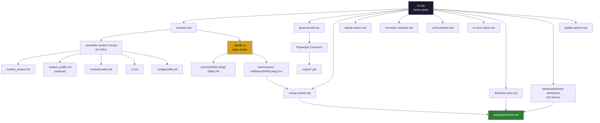
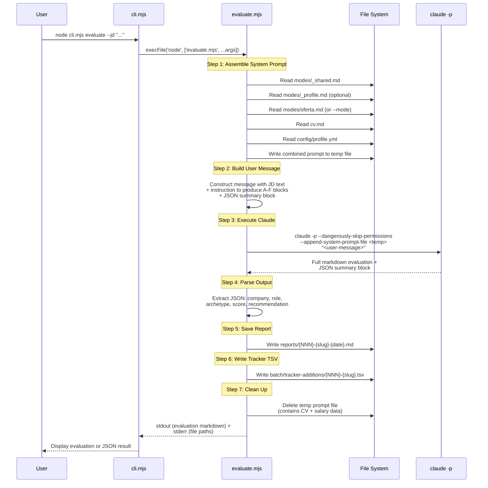

# Career-Ops CLI -- Complete Documentation

> Version 1.2.0 | MIT License | Author: Santiago Fernandez de Valderrama
> Last updated: 2026-04-09

---

## Table of Contents

1. [Overview](#overview)
2. [Architecture Diagram](#architecture-diagram)
3. [Evaluation Workflow](#evaluation-workflow)
4. [Scoring System](#scoring-system)
5. [Data Contract](#data-contract)
6. [File Structure](#file-structure)
7. [CLI Reference](#cli-reference)
8. [Profile Schema](#profile-schema)
9. [Database (Tracker) Schema](#database-tracker-schema)
10. [Configuration](#configuration)
11. [Dashboard TUI](#dashboard-tui)
12. [Pipeline Maintenance Scripts](#pipeline-maintenance-scripts)
13. [PDF Generation](#pdf-generation)
14. [Pattern Analysis](#pattern-analysis)
15. [Update System](#update-system)
16. [Integration with Job Scraper MVP](#integration-with-job-scraper-mvp)
17. [Troubleshooting](#troubleshooting)

---

## Overview

Career-Ops is an AI-powered job search pipeline that runs entirely on the local machine. It evaluates job descriptions against your CV using a structured A-F scoring system, generates ATS-optimized PDF resumes, tracks applications in a markdown-based database, and provides a terminal dashboard for pipeline management.

**What it does:**

- Evaluates job offers with a 6-block (A-F) scoring system across 10 weighted dimensions
- Generates tailored PDF resumes using Playwright and an HTML/CSS template
- Tracks all applications in a single markdown file (`data/applications.md`)
- Detects role archetypes (LLMOps, Agentic, PM, SA, FDE, Transformation) and adapts evaluation framing
- Provides pipeline integrity tools: merge, dedup, normalize, verify
- Includes a Go-based TUI dashboard for browsing and filtering the pipeline
- Supports batch processing of multiple offers in parallel via `claude -p` workers
- Analyzes rejection patterns and generates targeting recommendations

**Cost model: $0.** The `evaluate` command uses `claude -p` (Claude pipe mode), which is included in the Claude Max subscription at no per-token cost. PDF generation uses local Playwright/Chromium rendering. All other commands are local Node.js scripts with zero external API calls.

**Tech stack:**

| Component | Technology |
|-----------|------------|
| CLI & Scripts | Node.js (ESM, `.mjs`), zero npm dependencies beyond Playwright |
| AI Engine | `claude -p` (Claude Code pipe mode) |
| PDF Generation | Playwright Chromium headless |
| Dashboard TUI | Go + Bubble Tea + Lipgloss (Catppuccin Mocha theme) |
| Data Storage | Markdown tables, TSV files, YAML config |
| Fonts | Space Grotesk (headings) + DM Sans (body), self-hosted woff2 |

---

## Architecture Diagram



**How the CLI routes subcommands:**

Each subcommand in `cli.mjs` maps to a script file. The CLI spawns the script as a child process via `execFile`, captures stdout/stderr, and optionally wraps the output in a JSON envelope when `--json` is passed.

| Subcommand | Script | Spawned via |
|------------|--------|-------------|
| `evaluate` | `evaluate.mjs` | `execFile('node', ...)` |
| `pdf` | `generate-pdf.mjs` | `execFile('node', ...)` |
| `merge` | `merge-tracker.mjs` | `execFile('node', ...)` |
| `dedup` | `dedup-tracker.mjs` | `execFile('node', ...)` |
| `normalize` | `normalize-statuses.mjs` | `execFile('node', ...)` |
| `verify` | `verify-pipeline.mjs` | `execFile('node', ...)` |
| `sync-check` | `cv-sync-check.mjs` | `execFile('node', ...)` |
| `tracker` | `lib/tracker-json.mjs` | `execFile('node', ...)` |
| `dashboard` | `dashboard/career-dashboard(.exe)` | `execFile(binary, ...)` |
| `update` | `update-system.mjs` | `execFile('node', ...)` |

---

## Evaluation Workflow



**Prompt assembly order (Step 1):**

The system prompt is assembled by concatenating these files in order, separated by double newlines:

1. `modes/_shared.md` -- scoring system, global rules, tool config (required)
2. `modes/_profile.md` -- user archetypes, narrative, negotiation scripts (optional)
3. `modes/{mode}.md` -- mode-specific instructions, e.g., `oferta.md` (required)
4. `cv.md` -- wrapped under `## CV` header (required)
5. `config/profile.yml` -- wrapped under `## Profile` header (required)

The combined prompt is written to a temp file in the OS temp directory (e.g., `/tmp/career-ops-prompt-{timestamp}.md`), passed to Claude via `--append-system-prompt-file`, and deleted after execution completes.

**User message format (Step 2):**

```
Evaluate this job offer. Produce all 6 blocks (A-F) with scoring.
Output the complete evaluation in markdown format.

At the END of your response, include a JSON summary block:
```json
{"company": "...", "role": "...", "archetype": "...", "score": X.X, "recommendation": "apply|skip|maybe"}
```

JD:
<job description text>
```

**Output parsing (Step 4):**

The parser first attempts to extract a fenced JSON block from the end of Claude's output:

```
```json
{"company": "Anthropic", "role": "Senior AI Engineer", "archetype": "AI Platform / LLMOps", "score": 4.5, "recommendation": "apply"}
```
```

If JSON parsing fails, it falls back to regex patterns:
- `**Score:** X.X/5`
- `Score: X.X/5`
- `Global.*X.X/5`

---

## Scoring System

Defined in `modes/_shared.md`. Every evaluation produces scores across 5 dimensions plus a global weighted average.

### Scoring Dimensions

| Dimension | What It Measures |
|-----------|-----------------|
| **Match con CV** | Skills, experience, proof points alignment with the JD |
| **North Star alignment** | How well the role fits the user's target archetypes (from `_profile.md`) |
| **Comp** | Salary vs. market data (5 = top quartile, 1 = well below target) |
| **Cultural signals** | Company culture, growth trajectory, stability, remote policy |
| **Red flags** | Blockers and warnings that trigger negative score adjustments |
| **Global** | Weighted average of the above dimensions, on a 1-5 scale |

### Score Interpretation

| Score Range | Meaning | Recommended Action |
|-------------|---------|-------------------|
| 4.5 - 5.0 | Strong match | Apply immediately |
| 4.0 - 4.4 | Good match | Worth applying |
| 3.5 - 3.9 | Decent but not ideal | Apply only with specific reason to override |
| Below 3.5 | Poor match | Recommend against applying |

The system enforces an ethical guideline: scores below 4.0/5 trigger a recommendation against applying. The user can override this, but the system explicitly discourages low-fit applications.

### Archetype Detection

Every offer is classified into one (or a hybrid of two) archetypes:

| Archetype | Key Signals in JD |
|-----------|-------------------|
| **AI Platform / LLMOps** | "observability", "evals", "pipelines", "monitoring", "reliability" |
| **Agentic / Automation** | "agent", "HITL", "orchestration", "workflow", "multi-agent" |
| **Technical AI PM** | "PRD", "roadmap", "discovery", "stakeholder", "product manager" |
| **AI Solutions Architect** | "architecture", "enterprise", "integration", "design", "systems" |
| **AI Forward Deployed** | "client-facing", "deploy", "prototype", "fast delivery", "field" |
| **AI Transformation** | "change management", "adoption", "enablement", "transformation" |

After detection, the evaluation adapts proof point selection, CV summary rewriting, and STAR story framing based on the detected archetype.

### Evaluation Blocks (A-F)

Defined in `modes/oferta.md`. Every evaluation produces these blocks:

| Block | Title | Content |
|-------|-------|---------|
| **A** | Role Summary | Table: archetype, domain, function, seniority, remote policy, team size, TL;DR |
| **B** | CV Match | JD requirements mapped to exact CV lines. Gaps with severity, adjacent experience, and mitigation plans |
| **C** | Level & Strategy | Detected seniority vs. candidate level. "Sell senior without lying" plan. "If downleveled" plan |
| **D** | Comp & Demand | Market salary research (Glassdoor, Levels.fyi, Blind). Company comp reputation. Demand trends. Cited sources |
| **E** | Personalization Plan | Top 5 CV changes + top 5 LinkedIn changes. Table with current state, proposed change, and rationale |
| **F** | Interview Prep | 6-10 STAR+R stories mapped to JD requirements. Recommended case study. Red-flag questions and responses |

Block B adapts to archetype (FDE prioritizes fast delivery, SA prioritizes architecture, etc.).

Block F uses **STAR+R** format (Situation, Task, Action, Result + **Reflection**), where the Reflection column captures lessons learned. Stories are accumulated in `interview-prep/story-bank.md` across evaluations.

**Optional Block G** (only when score >= 4.5): Draft application form answers.

**Post-evaluation:** The report is saved to `reports/` and a tracker TSV is written to `batch/tracker-additions/`.

---

## Data Contract

Defined in `DATA_CONTRACT.md`. The codebase enforces a strict separation between user data and system files.

### User Layer (NEVER auto-updated)

Files containing personal data, customizations, and work product. Updates will never modify them.

| File | Purpose |
|------|---------|
| `cv.md` | Candidate's CV in markdown |
| `config/profile.yml` | Identity, targets, compensation range |
| `modes/_profile.md` | User archetypes, narrative, negotiation scripts |
| `article-digest.md` | Proof points from portfolio |
| `interview-prep/story-bank.md` | Accumulated STAR+R stories |
| `portals.yml` | Customized company list for scanner |
| `data/applications.md` | Application tracker |
| `data/pipeline.md` | URL inbox |
| `data/scan-history.tsv` | Scanner dedup history |
| `reports/*` | Evaluation reports |
| `output/*` | Generated PDFs |
| `jds/*` | Saved job descriptions |

### System Layer (safe to auto-update)

System logic, scripts, templates, and instructions that improve with each release.

| File | Purpose |
|------|---------|
| `modes/_shared.md` | Scoring system, global rules, tool config |
| `modes/oferta.md` | Evaluation mode instructions |
| `modes/pdf.md` | PDF generation instructions |
| `modes/scan.md` | Portal scanner instructions |
| `modes/batch.md` | Batch processing instructions |
| `modes/apply.md` | Application assistant instructions |
| `modes/auto-pipeline.md` | Auto-pipeline instructions |
| `modes/contacto.md` | LinkedIn outreach instructions |
| `modes/deep.md` | Research prompt instructions |
| `modes/ofertas.md` | Comparison instructions |
| `modes/pipeline.md` | Pipeline processing instructions |
| `modes/project.md` | Project evaluation instructions |
| `modes/tracker.md` | Tracker instructions |
| `modes/training.md` | Training evaluation instructions |
| `modes/interview-prep.md` | Interview prep instructions |
| `modes/patterns.md` | Pattern analysis instructions |
| `modes/de/*` | German language modes |
| `modes/fr/*` | French language modes |
| `modes/pt/*` | Portuguese language modes |
| `CLAUDE.md` | Agent instructions |
| `*.mjs` | Utility scripts |
| `batch/*` | Batch worker prompt and orchestrator |
| `dashboard/*` | Go TUI dashboard |
| `templates/*` | Base templates |
| `fonts/*` | Self-hosted fonts |
| `.claude/skills/*` | Skill definitions |
| `docs/*` | Documentation |
| `VERSION` | Current version number |

**The rule:** If a file is in the User Layer, no update process may read, modify, or delete it. If a file is in the System Layer, it can be safely replaced with the latest version from the upstream repo.

---

## File Structure

```
career-ops/
|-- CLAUDE.md                        # Agent instructions (system layer)
|-- DATA_CONTRACT.md                 # User/system file boundary definition
|-- VERSION                          # Current version (1.2.0)
|-- package.json                     # npm config (only dependency: playwright)
|
|-- cli.mjs                          # Main CLI entry point -- routes subcommands
|-- evaluate.mjs                     # Evaluate command -- assembles prompts, calls claude -p
|-- generate-pdf.mjs                 # PDF generation -- HTML to PDF via Playwright Chromium
|-- merge-tracker.mjs                # Merge TSV additions into applications.md
|-- dedup-tracker.mjs                # Remove duplicate tracker entries
|-- normalize-statuses.mjs           # Map non-canonical statuses to canonical values
|-- verify-pipeline.mjs              # Pipeline health check (7 checks)
|-- cv-sync-check.mjs                # Setup validation (cv.md, profile.yml, metrics)
|-- update-system.mjs                # Safe auto-updater (check/apply/rollback/dismiss)
|-- doctor.mjs                       # Full prerequisite validation
|-- check-liveness.mjs               # Playwright URL liveness checker
|-- analyze-patterns.mjs             # Rejection pattern analysis (JSON output)
|-- test-all.mjs                     # Test runner
|
|-- lib/
|   |-- tracker-json.mjs             # Parse applications.md into JSON (module + standalone)
|   +-- json-output.mjs              # JSON envelope and output parsers for each script
|
|-- modes/                           # Evaluation mode instructions (14 modes)
|   |-- _shared.md                   # Scoring system, global rules, tools (system)
|   |-- _profile.md                  # User archetypes, narrative (user layer)
|   |-- _profile.template.md         # Template for _profile.md
|   |-- oferta.md                    # Single offer evaluation (A-F blocks)
|   |-- ofertas.md                   # Multi-offer comparison
|   |-- pdf.md                       # PDF generation instructions
|   |-- scan.md                      # Portal scanner instructions
|   |-- batch.md                     # Batch processing instructions
|   |-- apply.md                     # Application form assistant
|   |-- auto-pipeline.md             # Auto-pipeline (evaluate + PDF + tracker)
|   |-- contacto.md                  # LinkedIn outreach message
|   |-- deep.md                      # Deep company research
|   |-- pipeline.md                  # Process pending URLs
|   |-- project.md                   # Portfolio project evaluation
|   |-- tracker.md                   # Tracker status overview
|   |-- training.md                  # Course/certification evaluation
|   |-- interview-prep.md            # Interview preparation
|   |-- patterns.md                  # Pattern analysis
|   |-- de/                          # German (DACH market) modes
|   |   |-- _shared.md
|   |   |-- angebot.md               # Evaluation (German)
|   |   |-- bewerben.md              # Apply (German)
|   |   +-- pipeline.md
|   |-- fr/                          # French (Francophone market) modes
|   |   |-- _shared.md
|   |   |-- offre.md                 # Evaluation (French)
|   |   |-- postuler.md              # Apply (French)
|   |   +-- pipeline.md
|   +-- pt/                          # Portuguese (Brazilian market) modes
|       |-- _shared.md
|       |-- oferta.md                # Evaluation (Portuguese)
|       |-- aplicar.md               # Apply (Portuguese)
|       +-- pipeline.md
|
|-- config/
|   +-- profile.example.yml          # Template for user profile configuration
|
|-- templates/
|   |-- cv-template.html             # ATS-optimized HTML/CSS CV template
|   |-- portals.example.yml          # Scanner company/query config template
|   +-- states.yml                   # Canonical application statuses
|
|-- data/                            # User tracking data (gitignored)
|   |-- applications.md              # Application tracker (markdown table)
|   |-- pipeline.md                  # URL inbox
|   +-- scan-history.tsv             # Scanner dedup history
|
|-- reports/                         # Evaluation reports (gitignored)
|-- output/                          # Generated PDFs (gitignored)
|-- jds/                             # Saved job descriptions (gitignored)
|-- interview-prep/                  # Story bank and company-specific intel
|
|-- fonts/                           # Space Grotesk + DM Sans (woff2)
|
|-- dashboard/                       # Go TUI pipeline viewer
|   |-- main.go                      # Entry point (Bubble Tea app)
|   +-- internal/
|       |-- data/                    # Tracker parser, metrics, report loader
|       |-- theme/                   # Catppuccin Mocha theme
|       +-- ui/screens/             # Pipeline list + report viewer screens
|
|-- batch/                           # Batch processing
|   |-- batch-prompt.md              # Self-contained worker prompt
|   |-- batch-runner.sh              # Orchestrator script
|   +-- tracker-additions/           # TSV files from evaluations
|       +-- merged/                  # Processed TSV files (moved after merge)
|
+-- docs/                            # Documentation
    |-- CLI.md                       # CLI reference
    |-- SETUP.md                     # Setup guide
    +-- APP_DOCUMENTATION.md         # This file
```

---

## CLI Reference

### Global Options

| Flag | Short | Description |
|------|-------|-------------|
| `--help` | `-h` | Show help text |
| `--version` | `-v` | Print version from VERSION file |
| `--json` | `-j` | Force JSON output for all subcommands |
| `--career-ops-path <path>` | `-p` | Override career-ops root directory (default: script directory) |

### JSON Output Envelope

All subcommands support `--json`. The standard envelope format:

```json
{
  "success": true,
  "exitCode": 0,
  "stdout": "...",
  "stderr": "",
  "duration_ms": 123
}
```

For `tracker` and `evaluate`, `stdout` contains structured JSON (not raw script output).

---

### `evaluate` -- AI Job Evaluation

Assembles career-ops mode files into a system prompt, sends the job description to Claude via `claude -p`, and returns a structured A-F evaluation.

**Cost: $0** -- uses `claude -p` which is included in the Claude Max subscription.

```bash
# Evaluate from inline text
node cli.mjs evaluate --jd "Full job description text here..."

# Evaluate from a file
node cli.mjs evaluate --jd-file jds/anthropic-senior-ai.md

# Evaluate from a URL (Claude extracts the JD)
node cli.mjs evaluate --url https://jobs.greenhouse.io/anthropic/12345

# Dry run -- see the assembled prompt without calling Claude
node cli.mjs evaluate --dry-run --jd "test"

# JSON output
node cli.mjs evaluate --json --jd "..."

# Use a different evaluation mode
node cli.mjs evaluate --mode training --jd "AWS ML Specialty certification..."

# Custom timeout (default: 300 seconds)
node cli.mjs evaluate --timeout 600 --jd "..."

# Skip saving report and/or tracker
node cli.mjs evaluate --skip-report --skip-tracker --jd "..."
```

**Options:**

| Flag | Description | Default |
|------|-------------|---------|
| `--jd <text>` | Job description text (inline) | -- |
| `--jd-file <path>` | Path to JD file (markdown or text) | -- |
| `--url <url>` | Job posting URL (passed to Claude for extraction) | -- |
| `--mode <mode>` | Evaluation mode file name (without `.md`) | `oferta` |
| `--dry-run` | Show assembled prompt without calling Claude | `false` |
| `--timeout <seconds>` | Timeout for `claude -p` execution | `300` |
| `--skip-report` | Do not save report to `reports/` | `false` |
| `--skip-tracker` | Do not write tracker TSV | `false` |
| `--json` | Output JSON result | `false` |
| `--career-ops-path` | Root path override | script directory |

**Available modes:** `oferta` (default), `ofertas`, `pdf`, `scan`, `batch`, `apply`, `pipeline`, `contacto`, `deep`, `training`, `project`, `tracker`, `auto-pipeline`, `interview-prep`, `patterns`

**Dry-run JSON output:**

```json
{
  "dryRun": true,
  "systemPromptPath": "/tmp/career-ops-prompt-123456.md",
  "systemPromptBytes": 19239,
  "filesAssembled": [
    "modes/_shared.md",
    "modes/_profile.md",
    "modes/oferta.md",
    "cv.md",
    "config/profile.yml"
  ],
  "userMessageChars": 354,
  "command": "claude -p --dangerously-skip-permissions --append-system-prompt-file ..."
}
```

**Evaluation JSON output:**

```json
{
  "success": true,
  "company": "Anthropic",
  "role": "Senior AI Engineer",
  "archetype": "AI Platform / LLMOps",
  "score": 4.5,
  "recommendation": "apply",
  "reportPath": "reports/015-anthropic-2026-04-09.md",
  "trackerTsvPath": "batch/tracker-additions/015-anthropic.tsv",
  "duration_ms": 45000,
  "claudeTokensUsed": null
}
```

---

### `pdf` -- Generate ATS-Optimized CV

Renders an HTML file to PDF using Playwright Chromium.

```bash
node cli.mjs pdf <input.html> <output.pdf> [--format=letter|a4]
```

**Options:**

| Flag | Description | Default |
|------|-------------|---------|
| `--format=letter` | US Letter (8.5 x 11 inches) | -- |
| `--format=a4` | A4 (210 x 297 mm) | `a4` |

The PDF generator includes automatic ATS normalization that converts problematic Unicode characters (em-dashes, smart quotes, zero-width characters, non-breaking spaces) to ASCII equivalents before rendering.

---

### `merge` -- Merge Tracker Additions

Merges TSV files from `batch/tracker-additions/` into `data/applications.md`.

```bash
node cli.mjs merge [--dry-run] [--verify]
```

**Options:**

| Flag | Description |
|------|-------------|
| `--dry-run` | Show what would be merged without writing changes |
| `--verify` | Run `verify-pipeline.mjs` after merge completes |

**Deduplication logic:**

1. Exact report number match (e.g., `[015]` in both files)
2. Exact entry number match
3. Normalized company name + fuzzy role match (2+ overlapping significant words)

If a duplicate is found with a **higher score**, the existing entry is updated in-place. Otherwise the new entry is skipped.

**Handles multiple TSV formats:**
- 9-column TSV (standard): `num\tdate\tcompany\trole\tstatus\tscore\tpdf\treport\tnotes`
- 8-column TSV (no notes): `num\tdate\tcompany\trole\tstatus\tscore\tpdf\treport`
- Pipe-delimited (markdown table row): `| col | col | ... |`

After merging, processed TSV files are moved to `batch/tracker-additions/merged/`.

---

### `dedup` -- Remove Duplicate Entries

```bash
node cli.mjs dedup [--dry-run]
```

Groups entries by normalized company name + fuzzy role match. Keeps the entry with the highest score. If a removed entry had a more advanced pipeline status (e.g., `Applied` beats `Evaluated`), the kept entry inherits that status. Creates a `.bak` backup before modifying.

**Status advancement order:** SKIP/Discarded (0) < Rejected (1) < Evaluated (2) < Applied (3) < Responded (4) < Interview (5) < Offer (6)

---

### `normalize` -- Normalize Statuses

```bash
node cli.mjs normalize [--dry-run]
```

Maps non-canonical statuses to canonical English values. Strips markdown bold (`**`) and trailing dates from status fields. Moves `DUPLICADO` info to the notes column.

---

### `verify` -- Pipeline Health Check

```bash
node cli.mjs verify
```

Runs 7 integrity checks:

1. All statuses are canonical (per `templates/states.yml`)
2. No duplicate company+role entries
3. All report links point to existing files
4. Scores match format `X.X/5`, `N/A`, or `DUP`
5. All rows have 9+ pipe-delimited columns
6. No pending TSVs in `tracker-additions/` (should be merged)
7. No markdown bold in score fields

Exit code 0 = healthy, exit code 1 = errors found.

---

### `sync-check` -- Setup Validation

```bash
node cli.mjs sync-check
```

Validates:

1. `cv.md` exists and is not too short (100+ characters)
2. `config/profile.yml` exists and does not contain example placeholder data
3. No hardcoded metrics in `modes/_shared.md` or `batch/batch-prompt.md`
4. `article-digest.md` freshness (warns if older than 30 days)

---

### `tracker` -- Tracker Data as JSON

```bash
node cli.mjs tracker [--metrics] [--pretty]
```

Parses `data/applications.md` and outputs structured JSON.

| Flag | Description |
|------|-------------|
| `--metrics` | Include aggregate metrics (total, avg score, by-status counts, top-scoring entries) |
| `--pretty` | Pretty-print JSON with 2-space indentation |

**Entry output:**

```json
{
  "number": 1,
  "date": "2026-04-01",
  "company": "Anthropic",
  "role": "Senior AI Engineer",
  "score": 4.5,
  "scoreRaw": "4.5/5",
  "status": "Evaluated",
  "hasPdf": true,
  "reportPath": "reports/001-anthropic-2026-04-01.md",
  "reportNumber": "001",
  "notes": "Strong match"
}
```

**Metrics output (with `--metrics`):**

```json
{
  "entries": [...],
  "metrics": {
    "total": 12,
    "avgScore": 3.84,
    "byStatus": {
      "Evaluated": 7,
      "Applied": 2,
      "Rejected": 1,
      "Discarded": 2
    },
    "topScoring": [
      { "number": 5, "company": "Temporal", "role": "Staff Platform Engineer", "score": 4.6 }
    ]
  }
}
```

The `tracker-json.mjs` module is also importable:

```javascript
import { parseTracker, computeMetrics } from './lib/tracker-json.mjs';

const entries = parseTracker('/path/to/career-ops');
const metrics = computeMetrics(entries);
```

**Status translation:** Spanish statuses are automatically translated to English canonical forms (e.g., `Evaluada` to `Evaluated`, `Aplicado` to `Applied`).

---

### `dashboard` -- TUI Pipeline Viewer

```bash
node cli.mjs dashboard
```

Launches the Go-based terminal UI. Requires building the Go binary first:

```bash
cd dashboard && go build -o career-dashboard.exe . && cd ..
```

Features: 6 filter tabs (All, Evaluated, Applied, Interview, Rejected, Discarded), 4 sort modes, grouped/flat view, lazy-loaded report previews (archetype, TL;DR, remote, comp), inline status changes, URL opening.

---

### `update` -- System Updates

```bash
node cli.mjs update check      # Check for updates (JSON output)
node cli.mjs update apply      # Apply available update
node cli.mjs update rollback   # Rollback last update
node cli.mjs update dismiss    # Dismiss update notification
```

The updater fetches only system-layer files from the upstream repo (`github.com/santifer/career-ops`). User-layer files are never touched. A backup git branch is created before applying, and a safety check verifies no user files were modified.

---

## Profile Schema

File: `config/profile.yml` (copy from `config/profile.example.yml`).

```yaml
candidate:
  full_name: "Jane Smith"              # Required. Used in CV header
  email: "jane@example.com"            # Required. Used in CV contact row
  phone: "+1-555-0123"                 # Optional. Never shared in outreach
  location: "San Francisco, CA"        # Required. Used for remote policy matching
  linkedin: "linkedin.com/in/janesmith"  # Optional. Used in CV and outreach
  portfolio_url: "https://janesmith.dev" # Optional. Linked in CV summary
  github: "github.com/janesmith"       # Optional
  twitter: "https://x.com/janesmith"   # Optional
  # canva_resume_design_id: "DAxxxxxxxxx"  # Optional. For Canva MCP visual CV

target_roles:
  primary:                             # North Star roles (what you optimize for)
    - "Senior AI Engineer"
    - "Staff ML Engineer"
  archetypes:                          # Helps evaluation score fit
    - name: "AI/ML Engineer"
      level: "Senior/Staff"            # Target seniority
      fit: "primary"                   # primary = dream role
    - name: "AI Product Manager"
      level: "Senior"
      fit: "secondary"                 # secondary = good fit
    - name: "Solutions Architect"
      level: "Mid-Senior"
      fit: "adjacent"                  # adjacent = stretch role

narrative:
  headline: "ML Engineer turned AI product builder"  # 1-line professional headline
  exit_story: "Built and sold my SaaS..."            # What makes you unique
  superpowers:                         # Top 3-5 differentiators
    - "End-to-end ML pipelines"
    - "Fast prototyping (idea to prod in 2 weeks)"
    - "Cross-functional communication"
  proof_points:                        # Projects with measurable impact
    - name: "Project Alpha"
      url: "https://janesmith.dev/project-alpha"
      hero_metric: "Reduced inference latency 40%"
    - name: "Open Source Tool"
      url: "https://github.com/janesmith/tool"
      hero_metric: "2K+ GitHub stars"
  # dashboard:                         # Optional demo URL
  #   url: "https://janesmith.dev/demo"
  #   password: "demo-2026"

compensation:
  target_range: "$150K-200K"           # Target total comp
  currency: "USD"                      # Currency code
  minimum: "$120K"                     # Walk-away number
  location_flexibility: "Remote preferred, 1 week/month on-site possible"

location:
  country: "United States"
  city: "San Francisco"
  timezone: "PST"
  visa_status: "No sponsorship needed"
  # onsite_availability: "1 week/month in any city"  # For remote roles
```

---

## Database (Tracker) Schema

### `data/applications.md` -- Application Tracker

A markdown table that serves as the single source of truth for all applications.

**Table format:**

```markdown
| # | Date | Company | Role | Score | Status | PDF | Report | Notes |
|---|------|---------|------|-------|--------|-----|--------|-------|
| 1 | 2026-04-01 | Anthropic | Senior AI Engineer | 4.5/5 | Evaluated | ... | [001](reports/001-anthropic-2026-04-01.md) | Strong match |
```

**Column definitions:**

| Column | Type | Description |
|--------|------|-------------|
| `#` | Integer | Sequential entry number |
| `Date` | `YYYY-MM-DD` | Date of evaluation |
| `Company` | String | Short company name |
| `Role` | String | Job title |
| `Score` | `X.X/5` or `N/A` or `DUP` | Global evaluation score out of 5 |
| `Status` | Canonical status string | Current pipeline status (see below) |
| `PDF` | Emoji | `(checkmark)` if PDF generated, `(cross)` if not |
| `Report` | Markdown link | `[NNN](reports/NNN-slug-date.md)` |
| `Notes` | String | Free-text notes |

**Important:** New entries are NEVER added by directly editing `applications.md`. They are written as TSV files to `batch/tracker-additions/` and then merged via `merge-tracker.mjs`. Existing entries CAN be edited in-place to update status or notes.

### Canonical Statuses

Defined in `templates/states.yml`. Both the Node.js scripts and the Go dashboard read this file.

| Status | Aliases (Spanish) | Description |
|--------|-------------------|-------------|
| `Evaluated` | `evaluada`, `condicional`, `hold`, `evaluar`, `verificar` | Report completed, pending decision |
| `Applied` | `aplicado`, `enviada`, `aplicada`, `sent` | Application submitted |
| `Responded` | `respondido` | Company responded (not yet interview) |
| `Interview` | `entrevista` | Active interview process |
| `Offer` | `oferta` | Offer received |
| `Rejected` | `rechazado`, `rechazada` | Rejected by company |
| `Discarded` | `descartado`, `descartada`, `cerrada`, `cancelada` | Discarded by candidate or offer closed |
| `SKIP` | `no aplicar`, `no_aplicar`, `monitor` | Does not fit, do not apply |

**Rules for the status field:**
- No markdown bold (`**`) allowed
- No dates allowed (use the Date column)
- No extra text (use the Notes column)
- Must be exactly one of the canonical values (case-insensitive)

### TSV Format for Tracker Additions

Each evaluation produces one TSV file in `batch/tracker-additions/`.

**Filename:** `{NNN}-{company-slug}.tsv`

**Format (9 tab-separated columns):**

```
{num}\t{date}\t{company}\t{role}\t{status}\t{score}/5\t{pdf_emoji}\t[{num}](reports/{num}-{slug}-{date}.md)\t{note}
```

| Column | Position | Format |
|--------|----------|--------|
| Entry number | 1 | Integer |
| Date | 2 | `YYYY-MM-DD` |
| Company | 3 | String |
| Role | 4 | String |
| Status | 5 | Canonical status (e.g., `Evaluated`) |
| Score | 6 | `X.X/5` |
| PDF | 7 | Emoji (`(checkmark)` or `(cross)`) |
| Report link | 8 | `[NNN](reports/NNN-slug-date.md)` |
| Notes | 9 | One-line summary |

**Note on column order:** In the TSV, status comes BEFORE score (columns 5 and 6). In `applications.md`, score comes BEFORE status (columns 5 and 6). The `merge-tracker.mjs` script detects column order via heuristics and handles the swap automatically.

### Report File Format

**Filename:** `{NNN}-{company-slug}-{YYYY-MM-DD}.md`

- `{NNN}` = 3-digit zero-padded sequential number (max existing + 1)
- `{company-slug}` = lowercase company name, spaces replaced with hyphens

**Report structure:**

```markdown
# Evaluation: {Company} -- {Role}

**Date:** {YYYY-MM-DD}
**Archetype:** {detected}
**Score:** {X/5}
**URL:** {job posting URL}
**PDF:** {path or pending}

---

## A) Role Summary
(Block A content)

## B) CV Match
(Block B content)

## C) Level & Strategy
(Block C content)

## D) Comp & Demand
(Block D content)

## E) Personalization Plan
(Block E content)

## F) Interview Prep
(Block F content)

## G) Draft Application Answers
(Only if score >= 4.5)

---

## Keywords
(15-20 keywords from JD for ATS optimization)
```

### `data/pipeline.md` -- URL Inbox

A markdown checklist for queuing job URLs before processing:

```markdown
# Pipeline -- URL Inbox

## Pendientes
- [ ] https://jobs.ashbyhq.com/anthropic/senior-ai-engineer | Anthropic | Senior AI Engineer

## Procesadas
(none yet)
```

URLs can reference local files as `local:jds/{file}` for JDs saved to the `jds/` directory.

---

## Configuration

### Environment and Prerequisites

| Requirement | Minimum Version | Check Command |
|-------------|-----------------|---------------|
| Node.js | >= 18.0.0 | `node --version` |
| npm | >= 6.0.0 | `npm --version` |
| Claude Code CLI | Latest | `claude --version` |
| Playwright Chromium | Latest | `npx playwright install chromium` |
| Go (for dashboard only) | >= 1.21 | `go version` |

Run `npm run doctor` (or `node doctor.mjs`) to validate all prerequisites.

### npm Scripts

Defined in `package.json`:

| Script | Command | Description |
|--------|---------|-------------|
| `npm run doctor` | `node doctor.mjs` | Validate all prerequisites |
| `npm run verify` | `node verify-pipeline.mjs` | Pipeline health check |
| `npm run normalize` | `node normalize-statuses.mjs` | Normalize statuses |
| `npm run dedup` | `node dedup-tracker.mjs` | Remove duplicates |
| `npm run merge` | `node merge-tracker.mjs` | Merge tracker additions |
| `npm run pdf` | `node generate-pdf.mjs` | Generate PDF |
| `npm run sync-check` | `node cv-sync-check.mjs` | Setup validation |
| `npm run update:check` | `node update-system.mjs check` | Check for updates |
| `npm run update` | `node update-system.mjs apply` | Apply update |
| `npm run rollback` | `node update-system.mjs rollback` | Rollback update |
| `npm run liveness` | `node check-liveness.mjs` | Check job URL liveness |

### Mode Files

Mode files in `modes/` control evaluation behavior. They are markdown files read by Claude as system prompt context.

| File | When Used |
|------|-----------|
| `_shared.md` | Always (scoring system, global rules) |
| `_profile.md` | Always (user customizations, overrides `_shared.md` defaults) |
| `oferta.md` | Single offer evaluation (default mode) |
| `ofertas.md` | Multi-offer comparison |
| `pdf.md` | PDF generation |
| `scan.md` | Portal scanning |
| `batch.md` | Batch processing |
| `apply.md` | Application form assistant |
| `auto-pipeline.md` | Full auto-pipeline (evaluate + PDF + tracker) |
| `contacto.md` | LinkedIn outreach |
| `deep.md` | Deep company research |
| `pipeline.md` | Process pending URLs |
| `project.md` | Portfolio project evaluation |
| `tracker.md` | Application status overview |
| `training.md` | Course/certification evaluation |
| `interview-prep.md` | Interview preparation |
| `patterns.md` | Rejection pattern analysis |

### Language Modes

Career-Ops supports multiple languages via mode directories:

| Directory | Language | Modes Available |
|-----------|----------|-----------------|
| `modes/` | English (default) | All 17 modes |
| `modes/de/` | German (DACH market) | `_shared.md`, `angebot.md` (eval), `bewerben.md` (apply), `pipeline.md` |
| `modes/fr/` | French (Francophone) | `_shared.md`, `offre.md` (eval), `postuler.md` (apply), `pipeline.md` |
| `modes/pt/` | Portuguese (Brazil) | `_shared.md`, `oferta.md` (eval), `aplicar.md` (apply), `pipeline.md` |

To use a different language, either:
1. Set `language.modes_dir: modes/de` in `config/profile.yml`
2. Tell Claude: "use German modes"
3. Claude auto-detects a German/French/Portuguese JD and suggests switching

### `templates/states.yml`

Canonical status definitions shared between Node.js scripts and the Go dashboard:

```yaml
states:
  - id: evaluated
    label: Evaluated
    aliases: [evaluada]
    description: Offer evaluated with report, pending decision
    dashboard_group: evaluated

  - id: applied
    label: Applied
    aliases: [aplicado, enviada, aplicada, sent]
    description: Application submitted
    dashboard_group: applied

  - id: responded
    label: Responded
    aliases: [respondido]
    description: Company has responded (not yet interview)
    dashboard_group: responded

  - id: interview
    label: Interview
    aliases: [entrevista]
    description: Active interview process
    dashboard_group: interview

  - id: offer
    label: Offer
    aliases: [oferta]
    description: Offer received
    dashboard_group: offer

  - id: rejected
    label: Rejected
    aliases: [rechazado, rechazada]
    description: Rejected by company
    dashboard_group: rejected

  - id: discarded
    label: Discarded
    aliases: [descartado, descartada, cerrada, cancelada]
    description: Discarded by candidate or offer closed
    dashboard_group: discarded

  - id: skip
    label: SKIP
    aliases: [no_aplicar, no aplicar, skip, monitor]
    description: Doesn't fit, don't apply
    dashboard_group: skip
```

---

## Dashboard TUI

The terminal dashboard is a Go application built with Bubble Tea and Lipgloss, using the Catppuccin Mocha color theme.

### Building

```bash
cd dashboard
go build -o career-dashboard.exe .   # Windows
go build -o career-dashboard .       # Linux/macOS
```

### Running

```bash
./career-dashboard --path /path/to/career-ops
# or via CLI:
node cli.mjs dashboard
```

### Architecture

The dashboard (`dashboard/main.go`) manages two views:

1. **Pipeline View** (`screens.PipelineModel`) -- Tabular list of all applications with filtering, sorting, and status changes
2. **Report View** (`screens.ViewerModel`) -- Full-screen markdown report reader

**Data flow:**
- `data.ParseApplications(path)` reads `data/applications.md`
- `data.ComputeMetrics(apps)` generates aggregate statistics
- `data.LoadReportSummary(path, reportPath)` lazily loads archetype, TL;DR, remote, and comp from report files
- `data.UpdateApplicationStatus(path, app, newStatus)` writes status changes back to `applications.md`

**Features:**
- 6 filter tabs (All, Evaluated, Applied, Interview, Rejected, Discarded)
- 4 sort modes
- Grouped and flat view
- Lazy-loaded report previews (archetype, TL;DR, remote, comp)
- Inline status changes
- URL opening in default browser (cross-platform: `open` on macOS, `xdg-open` on Linux, `cmd /c start` on Windows)

---

## Pipeline Maintenance Scripts

### Recommended Workflow

```
1. node cli.mjs evaluate --jd "..."     # Evaluate (creates report + TSV)
2. node cli.mjs merge --verify          # Merge TSV into applications.md + verify
3. node cli.mjs pdf input.html out.pdf  # Generate tailored CV
4. node cli.mjs verify                  # Check pipeline integrity
5. node cli.mjs tracker --json --pretty # View current pipeline state
6. node cli.mjs dashboard               # Visual pipeline browser
```

### Integrity Rules

1. **Never edit `applications.md` to ADD entries** -- Write TSV in `batch/tracker-additions/` and run `merge-tracker.mjs`
2. **Yes, you CAN edit `applications.md` to UPDATE status/notes** of existing entries
3. All reports must include `**URL:**` in the header
4. All statuses must be canonical (per `templates/states.yml`)
5. Report naming: `{NNN}-{company-slug}-{YYYY-MM-DD}.md` with zero-padded 3-digit number

---

## PDF Generation

### Template

The CV template (`templates/cv-template.html`) uses placeholder tokens that are replaced at generation time:

| Placeholder | Content |
|-------------|---------|
| `{{LANG}}` | HTML lang attribute (`en`, `es`, etc.) |
| `{{NAME}}` | Candidate full name |
| `{{EMAIL}}` | Email address |
| `{{LINKEDIN_URL}}` | Full LinkedIn URL |
| `{{LINKEDIN_DISPLAY}}` | Display text for LinkedIn link |
| `{{PORTFOLIO_URL}}` | Portfolio URL |
| `{{PORTFOLIO_DISPLAY}}` | Display text for portfolio link |
| `{{LOCATION}}` | Location string |
| `{{PAGE_WIDTH}}` | Page width CSS value |
| `{{SECTION_SUMMARY}}` | Section heading for Professional Summary |
| `{{SUMMARY_TEXT}}` | Professional summary content |
| `{{SECTION_COMPETENCIES}}` | Section heading for Core Competencies |
| `{{COMPETENCIES}}` | Competency tags HTML |
| `{{SECTION_EXPERIENCE}}` | Section heading for Work Experience |
| `{{EXPERIENCE}}` | Work experience HTML |
| `{{SECTION_PROJECTS}}` | Section heading for Projects |
| `{{PROJECTS}}` | Projects HTML |
| `{{SECTION_EDUCATION}}` | Section heading for Education |
| `{{EDUCATION}}` | Education HTML |
| `{{SECTION_CERTIFICATIONS}}` | Section heading for Certifications |
| `{{CERTIFICATIONS}}` | Certifications HTML |
| `{{SECTION_SKILLS}}` | Section heading for Skills |
| `{{SKILLS}}` | Skills HTML |

### Design

- **Headings font:** Space Grotesk (700 weight, -0.02em letter spacing)
- **Body font:** DM Sans (variable weight 100-1000)
- **Header accent:** Linear gradient from teal (`hsl(187, 74%, 32%)`) to purple (`hsl(270, 70%, 45%)`)
- **Section titles:** Teal, uppercase, 0.06em letter spacing, underline border
- **Company names:** Purple (`hsl(270, 70%, 45%)`)
- **Page margins:** 0.6 inches all sides
- **Font size:** 11px body, 28px name, 12px section titles, 10.5px details

### ATS Normalization

The `generate-pdf.mjs` script automatically normalizes the following Unicode characters before rendering:

| Character | Replacement | Why |
|-----------|-------------|-----|
| Em-dash (`\u2014`) | `-` | ATS parsers often fail on em-dashes |
| En-dash (`\u2013`) | `-` | Same issue |
| Smart double quotes (`\u201C`, `\u201D`, etc.) | `"` | Mojibake in legacy systems |
| Smart single quotes (`\u2018`, `\u2019`, etc.) | `'` | Same issue |
| Horizontal ellipsis (`\u2026`) | `...` | Parsing errors |
| Zero-width characters (`\u200B`, `\uFEFF`, etc.) | (removed) | Display issues |
| Non-breaking space (`\u00A0`) | ` ` (regular space) | Copy-paste issues |

Only body text is normalized -- CSS, JavaScript, tag attributes, and URLs are preserved.

---

## Pattern Analysis

The `analyze-patterns.mjs` script provides data-driven targeting recommendations based on application outcomes.

### Running

```bash
node analyze-patterns.mjs              # JSON output to stdout
node analyze-patterns.mjs --summary    # Human-readable table
node analyze-patterns.mjs --min-threshold 3  # Require N outcomes before analysis
```

### Analysis Dimensions

| Dimension | How It Works |
|-----------|-------------|
| **Conversion funnel** | Counts entries by status (evaluated, applied, responded, interview, offer, rejected, discarded, skip) |
| **Score by outcome** | Compares average scores for positive vs. negative outcomes |
| **Archetype breakdown** | Conversion rate per archetype (e.g., LLMOps 40%, PM 10%) |
| **Blocker analysis** | Classifies gaps into: geo-restriction, stack-mismatch, seniority-mismatch, onsite-requirement |
| **Remote policy** | Groups by: global remote, regional remote, geo-restricted, hybrid/onsite, unknown |
| **Company size** | Groups by: startup (<50), scaleup (50-500), enterprise (500+) |
| **Score threshold** | Finds the lowest score among positive outcomes |
| **Tech stack gaps** | Extracts technology keywords from gap descriptions in negative outcomes |

### Output

The script outputs structured JSON with:

- `metadata` -- total applications, date range, outcome counts
- `funnel` -- status counts
- `scoreComparison` -- avg/min/max score per outcome category
- `archetypeBreakdown` -- total, positive, negative, conversion rate per archetype
- `blockerAnalysis` -- frequency and percentage of each blocker type
- `remotePolicy` -- breakdown by remote policy
- `companySizeBreakdown` -- breakdown by company size
- `scoreThreshold` -- recommended minimum score
- `techStackGaps` -- most common technical skill gaps
- `recommendations` -- actionable suggestions with impact level (high/medium/low)

### Minimum Threshold

The analysis requires at least 5 applications beyond the `Evaluated` status (configurable via `--min-threshold`). This ensures statistical relevance before generating recommendations.

---

## Update System

The `update-system.mjs` script manages safe updates from the upstream `github.com/santifer/career-ops` repository.

### Commands

| Command | Description |
|---------|-------------|
| `node update-system.mjs check` | Check if an update is available (JSON output) |
| `node update-system.mjs apply` | Apply the update (fetches system files only) |
| `node update-system.mjs rollback` | Rollback to the last backup branch |
| `node update-system.mjs dismiss` | Dismiss the update notification (creates `.update-dismissed`) |

### Safety Guarantees

1. **Only system-layer files are updated.** The script maintains an explicit allowlist of paths (`SYSTEM_PATHS`) that can be overwritten.
2. **User files are never touched.** An explicit blocklist (`USER_PATHS`) is checked after every update. If any user file was modified, the update is automatically rolled back.
3. **Backup branch created before every update.** Named `backup-pre-update-{version}`.
4. **Lock file prevents concurrent updates.** `.update-lock` is created during the update process.

### Check Output

```json
{"status": "update-available", "local": "1.0.0", "remote": "1.2.0", "changelog": "..."}
{"status": "up-to-date", "local": "1.2.0", "remote": "1.2.0"}
{"status": "dismissed"}
{"status": "offline", "local": "1.2.0"}
```

---

## Integration with Job Scraper MVP

The CLI is designed to be called programmatically by external systems. The `--json` flag on every subcommand ensures machine-parseable output.

### API Surface for External Callers

| Operation | CLI Command | Returns |
|-----------|-------------|---------|
| Evaluate a JD | `node cli.mjs evaluate --json --jd "..."` | `{success, company, role, score, recommendation, reportPath}` |
| Generate PDF | `node cli.mjs pdf --json <in> <out>` | `{success, exitCode, stdout}` |
| Merge tracker | `node cli.mjs merge --json` | `{success, stdout}` (parseable via `parseMergeOutput`) |
| Get tracker data | `node cli.mjs tracker --json --metrics --pretty` | Array of entries + metrics |
| Health check | `node cli.mjs verify --json` | `{success, exitCode, stdout}` (parseable via `parseVerifyOutput`) |
| Setup validation | `node cli.mjs sync-check --json` | `{success, exitCode, stdout}` |

### JSON Output Parsers

The `lib/json-output.mjs` module provides structured parsers for each script's stdout:

| Parser | Extracts |
|--------|----------|
| `parseMergeOutput(stdout)` | `{added, updated, skipped}` |
| `parseDedupOutput(stdout)` | `{removed}` |
| `parseNormalizeOutput(stdout)` | `{normalized, unknowns[]}` |
| `parseVerifyOutput(stdout)` | `{errors, warnings, status, checks[]}` |
| `parseSyncCheckOutput(stdout)` | `{errors[], warnings[], status}` |
| `parsePdfOutput(stdout)` | `{outputPath, pages, sizeKb}` |

### Integration Pattern

An external service (e.g., a .NET ToolGateway plugin) would call the CLI via process execution:

```
External Service
  |
  +-- POST /evaluate  --> node cli.mjs evaluate --json --jd "..."
  +-- POST /pdf       --> node cli.mjs pdf --json ...
  +-- POST /merge     --> node cli.mjs merge --json
  +-- GET  /tracker   --> node cli.mjs tracker --json --metrics
  +-- GET  /verify    --> node cli.mjs verify --json
  +-- GET  /health    --> node cli.mjs sync-check --json
```

The `--career-ops-path` (`-p`) flag allows the external service to specify the career-ops root directory, enabling multiple career-ops instances or non-standard installation paths.

---

## Troubleshooting

### Common Issues

**"claude: command not found"**
Install Claude Code CLI: `npm install -g @anthropic-ai/claude-code`. Verify with `claude --version`.

**"cv.md not found" or "config/profile.yml not found"**
Run the onboarding flow: copy `config/profile.example.yml` to `config/profile.yml`, create `cv.md` with your CV in markdown, and optionally copy `modes/_profile.template.md` to `modes/_profile.md`.

**"Mode file not found: modes/{name}.md"**
The `--mode` flag must match a filename in `modes/` (without the `.md` extension). Available modes are listed in the error message.

**PDF generation fails**
Install Chromium for Playwright: `npx playwright install chromium`.

**Dashboard does not launch**
Build the Go binary first: `cd dashboard && go build -o career-dashboard.exe .`

**Merge shows 0 added, 0 updated**
Check that TSV files exist in `batch/tracker-additions/` (not in `merged/`). After merging, files are moved to `merged/`.

**Scores have markdown bold in applications.md**
Run `node cli.mjs normalize` to strip bold formatting and normalize statuses.

**Duplicate entries in tracker**
Run `node cli.mjs dedup` (use `--dry-run` first to preview). Creates a backup at `applications.md.bak`.

**Windows path errors**
Scripts use `fileURLToPath` for cross-platform path resolution. Ensure you are on version 1.1.0+ and using Node.js 18+.

### Diagnostic Commands

```bash
node cli.mjs --version            # Check CLI version
npm run doctor                    # Full prerequisite validation
node cli.mjs sync-check           # Setup consistency check
node cli.mjs verify               # Pipeline health check
node cli.mjs evaluate --dry-run --jd "test"  # Verify prompt assembly
```
